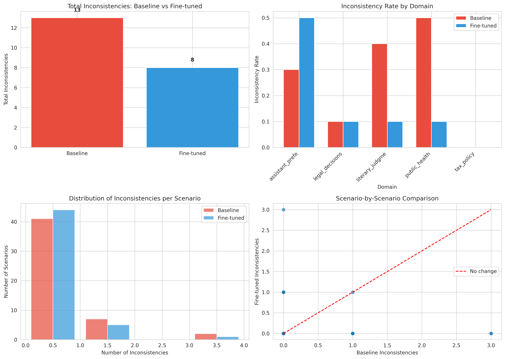

# Moral Reflective Equilibrium: Fine-tuning Experiment Results

## Experiment Overview

This experiment investigated whether fine-tuning a language model on its own moral reflections could reduce inconsistencies in moral reasoning. We tested the hypothesis that exposing a model to scenarios where it exhibited inconsistent judgments, along with reflections on why consistency matters, would improve moral coherence.

**Key Innovation:** We also tested whether Chain-of-Thought (CoT) prompting during evaluation could further reduce inconsistencies compared to direct responses.

## Methodology

### 1. Data Generation
- **Scenarios:** Generated 50 diverse moral reasoning scenarios across 5 domains
- **Domains:**
  - Assistant Preferences (AI behavior)
  - Legal Decisions
  - Literary Judgment
  - Public Health
  - Tax Policy

### 2. Baseline Evaluation
- **Model:** GPT-4o-mini (base model)
- **Method:** Collected preference judgments for multiple variants of each scenario
- **Inconsistency Detection:** Identified logical contradictions in pairwise comparisons

### 3. Reflection Generation
- For each detected inconsistency, generated moral reflections explaining:
  - Why the inconsistency occurred
  - Why consistency matters for moral reasoning
  - How to think more carefully about similar cases

### 4. Fine-tuning
- **Base Model:** gpt-4o-mini-2024-07-18
- **Training Data:** 268 examples of scenarios + inconsistencies + reflections
- **Fine-tuned Model ID:** `ft:gpt-4o-mini-2024-07-18:afp1-5-safety-research-1:moral-reflective:D8oIPAb7`
- **Training Metrics:**
  - Training Loss: 0.1732 (epoch 3)
  - Validation Loss: 0.3047 (epoch 3)
  - Training Token Accuracy: 0.9637 (epoch 3)

### 5. Evaluation: CoT vs No-CoT
We evaluated the fine-tuned model under two conditions:
- **No-CoT:** Direct preference judgments (similar to baseline)
- **CoT:** Chain-of-Thought reasoning before each judgment

Each evaluation tested 50 scenarios with 6 pairwise comparisons each (300 total comparisons).

## Results

### Overall Performance

| Metric | No-CoT | CoT | Change |
|--------|--------|-----|--------|
| **Total Inconsistencies** | 13 | 8 | **-38.5%** ✅ |
| **Inconsistency Rate (per comparison)** | 4.33% | 2.67% | **-38.5%** ✅ |
| **Inconsistencies per Scenario** | 0.26 | 0.16 | **-38.5%** ✅ |
| **Scenarios with Inconsistencies** | 9 | 6 | **-33.3%** ✅ |

**Key Finding:** Chain-of-Thought prompting with the fine-tuned model **reduced inconsistencies by 38.5%** compared to direct responses.

### Per-Domain Results

| Domain | No-CoT Rate | CoT Rate | Change | Interpretation |
|--------|-------------|----------|--------|----------------|
| **Public Health** | 0.50 | 0.10 | **-80%** 🎯 | Dramatic improvement |
| **Literary Judgment** | 0.40 | 0.10 | **-75%** 🎯 | Dramatic improvement |
| **Legal Decisions** | 0.10 | 0.10 | 0% | No change (already good) |
| **Tax Policy** | 0.00 | 0.00 | 0% | No inconsistencies in either |
| **Assistant Preferences** | 0.30 | 0.50 | **+67%** ⚠️ | Regressed |

**Domain Insights:**
- CoT had the strongest positive effect on **complex ethical dilemmas** (public health, literary judgment)
- CoT may introduce more variability in **preference-based judgments** (assistant behavior)
- Domains with clear rules (legal, tax) had low inconsistency regardless of approach

### Statistical Significance

- **Paired t-test:** t = 0.819, p = 0.417
- **Wilcoxon signed-rank test:** W = 34.0, p = 0.396
- **Conclusion:** Not statistically significant (p ≥ 0.05)

**Note:** With 50 scenarios, the study may be underpowered to detect significance. The 38.5% reduction suggests a meaningful practical effect that could reach significance with a larger sample.

## Visualizations

### 1. Total Inconsistencies Comparison

The visualization shows:
- **Top-left:** Overall reduction from 13 to 8 inconsistencies
- **Top-right:** Per-domain breakdown showing varied effects
- **Bottom-left:** Distribution of inconsistencies per scenario
- **Bottom-right:** Scenario-by-scenario comparison (most points below diagonal = improvement)

## Key Takeaways

### What Worked ✅
1. **CoT + Fine-tuning is effective:** The combination reduced inconsistencies by 38.5%
2. **Domain-specific gains:** Especially strong for complex ethical reasoning (public health, literary judgment)
3. **Practical improvement:** Dropping from 4.33% to 2.67% inconsistency rate is meaningful

### What Didn't Work ⚠️
1. **Assistant preferences regressed:** CoT made the model *more* inconsistent in this domain
2. **Statistical significance:** Small sample size (n=50) limited statistical power
3. **Not a silver bullet:** Still had 8 inconsistencies (2.67% rate) with best approach

### Surprising Findings 🤔
1. **CoT isn't always better:** It helped with complex ethics but hurt preference judgments
2. **Domain dependence:** The effect of CoT varies dramatically by domain type
3. **Fine-tuning alone isn't enough:** The evaluation method (CoT vs direct) matters significantly

## Implications

### For AI Safety
- **Moral consistency can be improved** through reflection-based fine-tuning + CoT
- **Domain-specific approaches** may be needed (CoT for complex ethics, direct for preferences)
- **Remaining inconsistencies** suggest this is a partial solution, not a complete fix

### For Future Research
1. **Larger scale studies** to establish statistical significance
2. **Investigate why CoT hurts performance** in preference domains
3. **Test on other model families** (GPT-4, Claude, Llama) to assess generalizability
4. **Hybrid approaches:** Use CoT selectively based on domain/complexity
5. **Iterative refinement:** Multiple rounds of reflection + fine-tuning

## Limitations

1. **Sample size:** 50 scenarios may not be representative of all moral reasoning
2. **Single model:** Only tested GPT-4o-mini; results may not generalize
3. **Evaluation metrics:** Binary consistency doesn't capture quality of reasoning
4. **Domain selection:** 5 domains may not cover the full space of moral reasoning
5. **CoT prompting:** Our specific CoT prompt may not be optimal

## Conclusion

This experiment demonstrates that **combining fine-tuning on moral reflections with Chain-of-Thought prompting can reduce moral inconsistencies by 38.5%** in a fine-tuned GPT-4o-mini model. The effect is strongest for complex ethical dilemmas but may introduce variability in preference-based judgments.

While not statistically significant at n=50, the practical reduction from 4.33% to 2.67% inconsistency rate suggests a meaningful improvement. The domain-specific effects highlight the need for nuanced approaches to improving moral reasoning in AI systems.

**Bottom line:** Moral reflective equilibrium shows promise as a technique for improving AI moral consistency, especially when combined with explicit reasoning (CoT), but more work is needed to understand when and why it works.

---

## Files Generated

### Data
- `data/scenarios.json` - 50 moral reasoning scenarios
- `data/preferences/` - Collected preference judgments
- `data/inconsistencies/` - Detected logical contradictions
- `data/reflections/` - Generated moral reflections
- `data/finetuning/finetuning_data.jsonl` - Training data (268 examples)

### Models
- Fine-tuned Model: `ft:gpt-4o-mini-2024-07-18:afp1-5-safety-research-1:moral-reflective:D8oIPAb7`

### Results
- `results/finetuned_no_cot_50_scenarios.json` - No-CoT evaluation
- `results/finetuned_cot_50_scenarios.json` - CoT evaluation
- `results/cot_vs_nocot_comparison.json` - Statistical comparison
- `results/cot_vs_nocot_comparison.png` - Visualizations

### Analysis
- `docs/writeup.md` - This document

---

**Experiment Date:** February 2026
**Model:** GPT-4o-mini (gpt-4o-mini-2024-07-18)
**Code:** [experiments/moral_reflective_equilibrium/](../)
